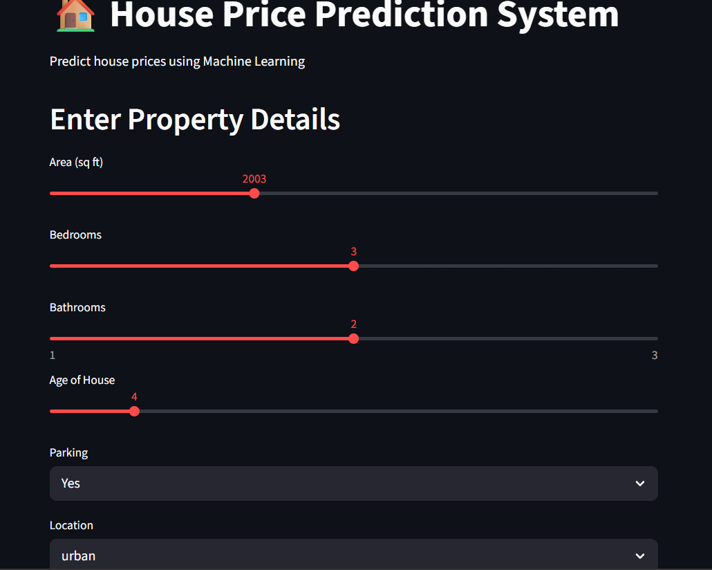
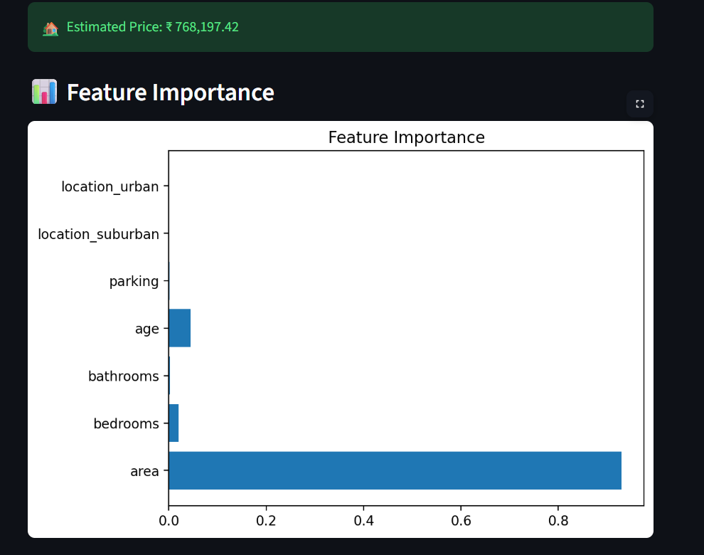

# 🏠 House Price Prediction using Machine Learning

<p align="center">
  
  
  
  
</p>

---

## 🌐 Live Demo

🚀 **Try the App Here:**
👉 http://localhost:8501/

---

## 📌 Project Overview

This project is a Machine Learning-based system that predicts house prices based on property features such as area, number of bedrooms, location, and more.

It simulates how real estate platforms estimate property values using data-driven models.

---

## 🎯 Problem Statement

Real estate pricing is often inconsistent and influenced by multiple factors.
This project aims to:

* Predict accurate house prices
* Reduce manual valuation errors
* Provide data-driven insights

---

## 💼 Industry Relevance

This system is useful for:

* 🏢 Real Estate Companies – price estimation
* 🌐 Property Platforms – listing recommendations
* 🏦 Banks – loan approval & valuation
* 💼 Investors – identify profitable properties
* 🧑‍💼 Buyers & Sellers – fair pricing decisions

---

## ⚙️ Tech Stack

* **Python**
* **Pandas & NumPy**
* **Scikit-learn**
* **Matplotlib**
* **Streamlit**

---

## 🤖 Machine Learning Models

* Linear Regression
* Random Forest Regressor ✅ *(Final Model Used)*

---

## 📊 Features Used

* Area (sq ft)
* Bedrooms
* Bathrooms
* Age of property
* Parking availability
* Location (Urban / Suburban / Rural)

---

## 🧠 How It Works

```text
User Input → Data Processing → Model Prediction → Price Output → Visualization
```

1. User enters property details
2. Data is processed & encoded
3. Model predicts house price
4. Results are displayed instantly

---

## 🚀 How to Run Locally

### 1️⃣ Clone Repository

```bash
git clone https://github.com/sinchana4778-lang/House-Price-Prediction-ML
cd House-Price-Prediction-ML
```

### 2️⃣ Install Requirements

```bash
pip install -r requirements.txt
```

### 3️⃣ Run App

```bash
streamlit run app.py
```

---

## 📸 Screenshots

### 🖥️ User Interface



### 💰 Prediction Output



### 📊 Feature Importance


---

## 📈 Results

* High accuracy prediction model
* Interactive UI using Streamlit
* Real-time prediction system
* Feature importance visualization

---

## 🎓 Learning Outcomes

* Regression modeling techniques
* Data preprocessing & feature engineering
* Model evaluation (MAE, RMSE, R²)
* Building ML web apps using Streamlit
* Deploying ML projects

---

## 🔮 Future Improvements

* Use real-world housing datasets
* Add location-based pricing maps
* Deploy with FastAPI backend
* Add user authentication
* Advanced dashboard (Next.js)

---

## 👩‍💻 Author

**Sinchana Gowda**

---

## ⭐ Support

If you like this project:

* ⭐ Star this repository
* 🍴 Fork it
* 📢 Share it

---

## 📬 Contact

Feel free to connect on LinkedIn and share your feedback!

---

# 🚀 Final Note

This project demonstrates how Machine Learning can solve real-world problems in the real estate domain using data-driven insights.
